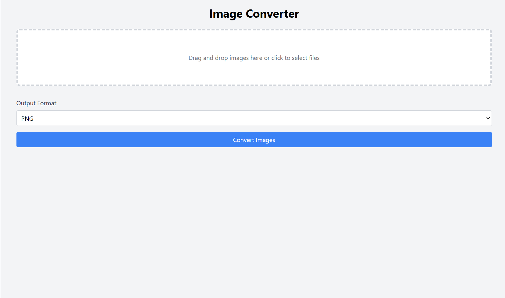
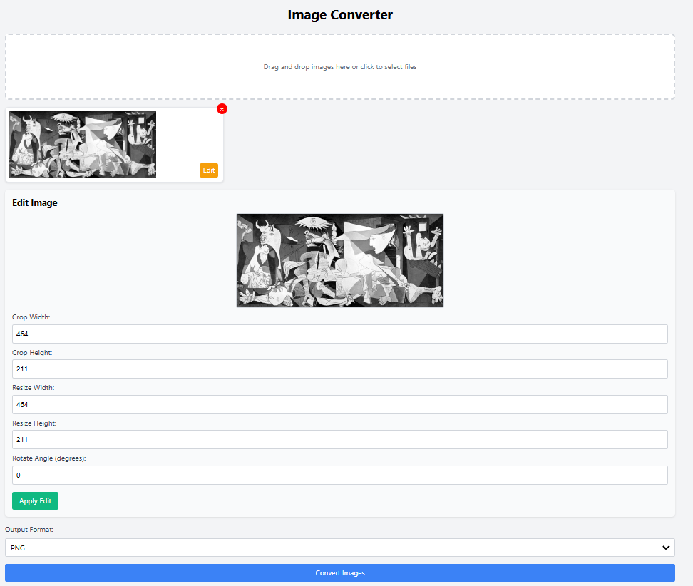

# Image Converter

A simple web application for converting, resizing, cropping, and rotating images. Built with HTML, Tailwind CSS, and JavaScript, this tool provides a streamlined image processing experience directly in your browser, **without sending your images to any external servers.**

**Live Demo:** [https://amirthfultehrani.github.io/Browser-Image-Converter/](https://amirthfultehrani.github.io/Browser-Image-Converter/)

## Why This Image Converter? Privacy!

While many online image conversion services exist, they often require uploading your images to their servers. While they may say they will delete your files after a set amount of time, there's no *guarantee* — no absolute certainty — that the data is truly gone (backed up somewhere, perhaps, or lingering in some forgotten cache); you have limited control over how your data is handled. And though you can simply right-click an image file and change the extension, that doesn't actually *convert the underlying image data* — it merely changes the file's label — so this tool helps to let you perform a *true* conversion, and all locally, within your browser, so your images never leave your computer, ensuring complete privacy and control over your sensitive data.

## Features

*   **Drag-and-Drop Interface:** Upload images by dragging them onto the designated area or by clicking to select files.
*   **Image Preview:** View thumbnails of uploaded images before conversion.
*   **Edit Controls:**
    *   **Cropping:** Specify crop width and height.
    *   **Resizing:** Set desired width and height for resizing.
    *   **Rotation:** Rotate images by a specified angle (0-360 degrees).
    * **Live Preview:** Shows changes made to the selected image, letting you see changes you make in real-time.
*   **Format Selection:** Choose from various output formats:
    *   PNG
    *   JPEG
    *   WEBP
    *   GIF
    *   BMP
*   **Batch Conversion:** Convert multiple images simultaneously.
*   **Progress Tracking:** A progress bar and text display the conversion progress.
*   **Metadata Preservation:** EXIF data is preserved during conversion (where applicable).
*   **ZIP Download:** Converted images are automatically downloaded as a convenient ZIP file.
* **Accessibility**: Includes `role`, and `aria-` attributes to better assist those using assistive technology.

## How to Use

1.  **Open the HTML file (`index.html`) in a web browser, or visit the live demo.**
2.  **Upload Images:** Drag and drop image files onto the "Drag and drop images here" area, or click the area to select files using the file dialog.
3.  **Preview Images:** Thumbnails of the uploaded images will appear in the preview area.
4.  **Edit Images (Optional):**
    *   Click on an image preview to select it for editing.
    *   The "Edit Image" controls will appear.
    *   Adjust the crop, resize, and rotate settings as needed.
    *   Click "Apply Edit" to apply the changes to the selected image. The Live Preview will show you the results.
5.  **Select Output Format:** Choose the desired output format (PNG, JPEG, WEBP, GIF, BMP) from the dropdown menu.
6.  **Convert Images:** Click the "Convert Images" button. The button will be disabled until images are uploaded.
7.  **Download:** Once the conversion is complete, a ZIP file containing the converted images will be automatically downloaded. The progress bar will show the conversion progress.

## Contributing

Contributions are welcome! If you find a bug or have a feature request, please open an issue on the GitHub repository. If you'd like to contribute code, please fork the repository and submit a pull request.

## License

